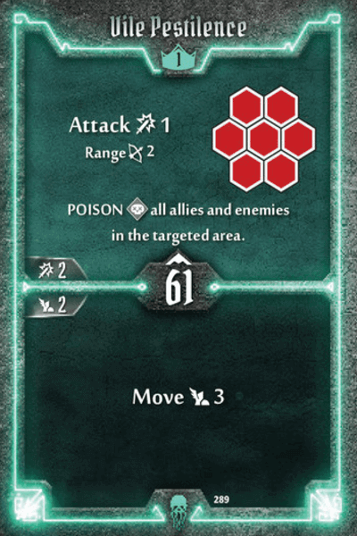
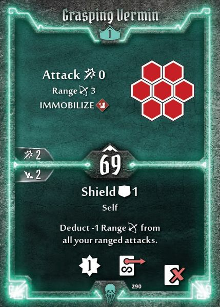

# Plagueherald

## General notes

The Plagueherald is one of my favorite classes to play as, and probably my favorite class when it comes to theme.
I believe they’re a support class at heart, but being a sentient swarm of insects, its definition of “support” might not be exactly what comes to our minds when we hear the word. They don’t have many direct heals or disables (stun/disarm) as most other support classes, nor do they recover cards. So what does this death and decay obsessed monstrosity do to support their teammates? In two words: Curses and Poison. I will go into these in more detail later. However they are still a respectable damage dealer, sporting a variety of single- and multi-target attacks.

The Plagueherald has a respectable 11-card hand. Normally this means that you can afford to bring more situational cards, or that you can easily lose a card to damage without feeling the stamina pressure. However their large hand is slightly offset by a somewhat unique mechanic where they have several persistent loss cards that provide them with different passive effects they would normally not be able to do. I personally find this incredibly thematic. You are a swarm of different insects that can adapt and change depending on the situation. It gives the class a slight T-1000 feel. Your multitudinous body can make you fly, or poison everything around it, or become more resilient to damage… There are lots of these and they allow you to customize and build a Plagueherald that plays and feels differently than the next guy’s.

Another great strength of the class is their ability to do true damage. By ‘true damage’ I’m referring to damage that ignores shields and modifier decks, similar to Cragheart’s Massive Boulder. The Plagueherald has several ways to deal true damage to enemies, providing the party with an effective way to deal with high-shield enemies, as well as having a way to still deal reliable damage in high-curse / high-muddle / high-disarm scenarios.

Lastly something you’ll quickly notice when looking through the cards, is that this class has pretty terrible initiative. And I don’t just mean you’ll need to get used to going slow most of the time like the Cragheart, but a lot of their initiative values are in the 40-60 range. I have found that middling initiative is the most unreliable. Sometimes you’ll go before some monsters, sometimes after, and good luck planning with any kind of certainty. You do have some notable exceptions in some pretty slow and fairly fast cards. These will likely prove to be quite valuable and don't be surprised if you wind up playing them for the initiative alone some times. I initially dismissed a card as situational but in practice I ended up bringing it to almost every scenario due to its 16 initiative. And yes, that is indeed exceptionally fast for this class.

## On curse and poison

These two mechanics are central to the class. Thriving in illness and corruption is what a Plagueherald is all about and you’ll have a lot of fun spreading disease through the enemy ranks (and sometimes allied ranks too!). Traditionally curse and poison are seen as two distinct playstyles, and I do categorize them as such in the Sub-classes section, but in practice I don’t think you can fully eschew one, no matter how hard you specialize into the other one.

Curses mitigate the damage your team takes. Specifically, when drawn they make an attack deal 0 damage. Whether it was attack 1 or attack 9, it is now 0. This power is offset by the inherent randomness factor. When you curse an enemy, you don’t directly negate their next attack, but rather you put a curse card in the enemy’s deck. The more curse cards, the higher the likelihood a given enemy will draw one. Note that enemies that are immune to curse (such as bosses) are still affected and have their attack deal no damage if they draw a curse modifier card.

I don’t feel like doing lots of math right now, but I can add in a few quick benchmarks to illustrate the power of curses.

* Enemies start out with a 5% chance to draw a Null if they haven’t drawn any modifier cards yet.
* This chance goes up as they draw modifier cards. If they’ve drawn 5 cards, they have a ~7% chance. With 10 cards it goes up to 10%. 15 cards drawn makes the chance 20%.
* One curse almost doubles the initial chance, bringing it up to ~9.5%. This isn’t bad though not amazing by any means.
* This obviously increases with more curses. At 5 curses, monsters have a 24% chance to draw a Null. All 10 curses gives a considerable 37% chance to draw a Null; more than 1 in 3.
* Disadvantage greatly increases the odds. 1 curse with disadvantage means ~20%, while 10 curses with disadvantage is a whopping 75% chance to draw a Null.

Maybe I should’ve drawn some charts or something but whatever. The takeaways are:

1. The more curses you can put in, the better (you can easily put in all 10 cards on your own).
2. Disadvantage pairs excellently with curses (you have some ways to do this reliably at higher levels, or you can rely on teammates).
3. The more cards monsters have drawn, the more likely it is they’ll draw a curse (this sort of happens naturally, as you progressively fill in their deck as they continue to draw cards).

You may have seen curses before, since some classes can put a few curses in, mixed in with what they normally do, but the Plagueherald is the king (queen? polyarch?) of curses, and no one else can compete with them on this. Only one other class can potentially match the amount of curses put in, but they still can’t capitalize on them as much. This is because at high levels, the Plagueherald can make it so that when a monster draws a curse card, not only does it deal no damage, but it immediately suffers true damage as well.

Poison as you know increases the damage a target takes when attacked. This is different than direct buffs like the tinkerer’s Enhancement Field, since its duration lasts indefinitely until the monster is healed, or it dies (additionally it’s the only way, besides stuns, to prevent monster healing). And it's more reliable than other buffs. Everyone, including the Plagueherald, benefits from this damage increase regardless of their positioning or initiative order. This damage increase fits nicely with the Plagueherald's lower-damage multi-target attacks, making you want to spread poison to as many targets as possible so you can then drop that AoE (Area of Effect) on them.

Most notably, they also have several other cards that interact with poisoned enemies in unique ways. Mostly based around dealing true damage to poisoned enemies. It’s important to note that these cards have no range restriction, and thus allow you to still deal true damage while you’re off doing other things in the opposite side of the map (assuming your team has a way to poison enemies for you of course).

The Plagueherald is unique in that they view poison also as a blessing, and thus they have several ways they can poison their own allies. Sometimes this can result in the ally benefiting from something if they’re poisoned, or it can result in the Plagueherald dealing more damage at their allies’ expense. Remember that since you are not your own ally, cards like Vile Pestilence that say "Poison all allies in the targeted area" can't affect you.

## Subclass roles

I really like the little introduction to this section Darren has in his Scoundrel Guide, so I'm shamelessly going to steal it:
Each class has a few different roles it can fill. The beauty of building a character is you can take as much or as little of any one philosophy as you want.

### Poisoner

This role is all about spreading poison to enemies and exploiting the class’ unique interactions with poison. It can carry some risk of poisoning your own allies (honestly easily avoidable), especially at lower levels, but the payoff is great. It can deal a lot of true damage and boost the team’s overall damage output.

### Cursemonger

Perhaps the most common (at least according to guides) way to build the Plagueherald, this focuses on saturating the enemy deck with curses, and then doubling their value from a level 7 card. You can fill out the enemy deck pretty early, and can continuously replenish drawn curses while dealing reliable damage.

### Support

You might think it’s weird that I call the class as a whole a support class, and then have this as a sub-class. The support sub-class here refers to the more traditional support ideas, heals, disables, buffs, etc. Even though going with a poisoner or cursemonger build will incidentally support your team, you can elect to make it your focus.

### Striker

The Plagueherald has a good amount of decent single-target and multi-target direct damage options. They additionally have a few ways they can boost their damage, so if you want to, they can be built as a pretty effective, more traditional, damage dealer.

## Card analysis

### Level 1 and X

#### Vile Pestilence

|position|description|
|-|-|
| Top | A mid-range AoE attack that poisons everything in its area, including allies. This is one of the cards responsible for the Plagueherald’s infamy of poisoning their own team, but unless everyone else is melee, this is pretty easy to avoid. The short range is slightly mitigated by the decently sized AoE. It's pretty powerful at low-levels no matter your build, since it softens up multiple targets and leaves them poisoned, making it more likely the next attack finishes them off. |
|Bottom|Nothing much to say here. Move 3 is better than move 2.|

#### Grasping Vermin

|position|description|
|-|-|
| Top | AoE attack that immobilizes. This card is fairly unique in that it has a base attack of 0. Other supports would have a similar effect with no attack involved, but the attack here goes nicely with previously-applied poison, or your rolling status effects from perks. |
|Bottom|The first of the persistent passive effects. This makes you more durable at the expense of making your attacks shorter range. This could be a good card in 2 player or in a team where you’ll be getting focused a lot. But at higher player counts the range penalty outweighs the benefit of the shield in my opinion. Perhaps there’s an obscure tanking Plagueherald build out there?|

#### Vile Pestilence

|position|description|
|-|-|
| Top | AoE attack that immobilizes. This card is fairly unique in that it has a base attack of 0. Other supports would have a similar effect with no attack involved, but the attack here goes nicely with previously-applied poison, or your rolling status effects from perks. |
|Bottom|The first of the persistent passive effects. This makes you more durable at the expense of making your attacks shorter range. This could be a good card in 2 player or in a team where you’ll be getting focused a lot. But at higher player counts the range penalty outweighs the benefit of the shield in my opinion. Perhaps there’s an obscure tanking Plagueherald build out there?|

